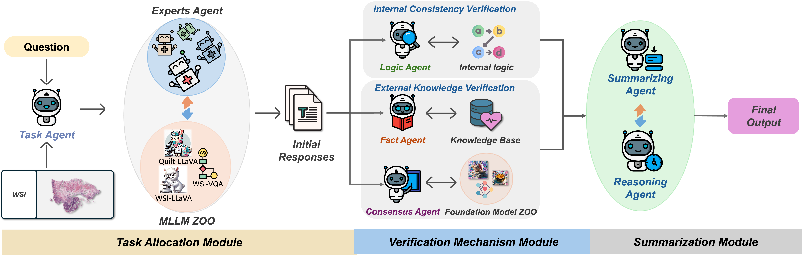

<div align="center">
<h1>WSI-Agents: A Collaborative Multi-Agent System for Multi-Modal Whole Slide Image Analysis</h1>

[Xinheng Lyu](https://scholar.google.com.hk/citations?user=4Id5lnYAAAAJ&hl) · [Yuci Liang]() · [Wenting Chen*](https://scholar.google.com/citations?user=3dtKW_8AAAAJ&hl) · [Meidan Ding](https://scholar.google.com/citations?user=u6-ueNoAAAAJ&hl) · [Jiaqi Yang]() · [Guolin Huang](https://scholar.google.com/citations?user=3Kv4D8MAAAAJ&hl) · [Daokun Zhang](https://scholar.google.com/citations?user=ar_onRIAAAAJ&hl=en) · [Xiangjian He*](https://scholar.google.com/citations?user=BiBXGfIAAAAJ&hl) · [Linlin Shen*](https://scholar.google.com/citations?user=AZ_y9HgAAAAJ&hl)

<sup>*</sup>Corresponding Authors

[](https://arxiv.org/abs/2507.14680)

</div>

## Description

**WSI-Agents** is a collaborative multi-agent system for multi-modal whole slide image analysis. The framework integrates specialized agents with verification mechanisms to enhance both task-specific accuracy and multi-task versatility in digital pathology.

<!-- Use Figure 1: framework overview -->

<div align="center">    
  
</div>

## Architecture

<!-- Use Figure 2: detailed system architecture -->

<div align="center">    
  
</div>

## Key Components

- **Task Allocation Module**: Assigns tasks to expert agents using model zoo
- **Verification Mechanism**: Internal consistency and external knowledge validation  
- **Summary Module**: Synthesizes results with visual interpretation


## More Information
 
For code and implementation details, please see [here](https://github.com/XinhengLyu/WSI-Agents).

### Citation

```bibtex
@article{lyu2025wsi,
  title={WSI-Agents: A Collaborative Multi-Agent System for Multi-Modal Whole Slide Image Analysis},
  author={Lyu, Xinheng and Liang, Yuci and Chen, Wenting and Ding, Meidan and Yang, Jiaqi and Huang, Guolin and Zhang, Daokun and He, Xiangjian and Shen, Linlin},
  journal={arXiv preprint arXiv:2507.14680},
  year={2025}
}
```